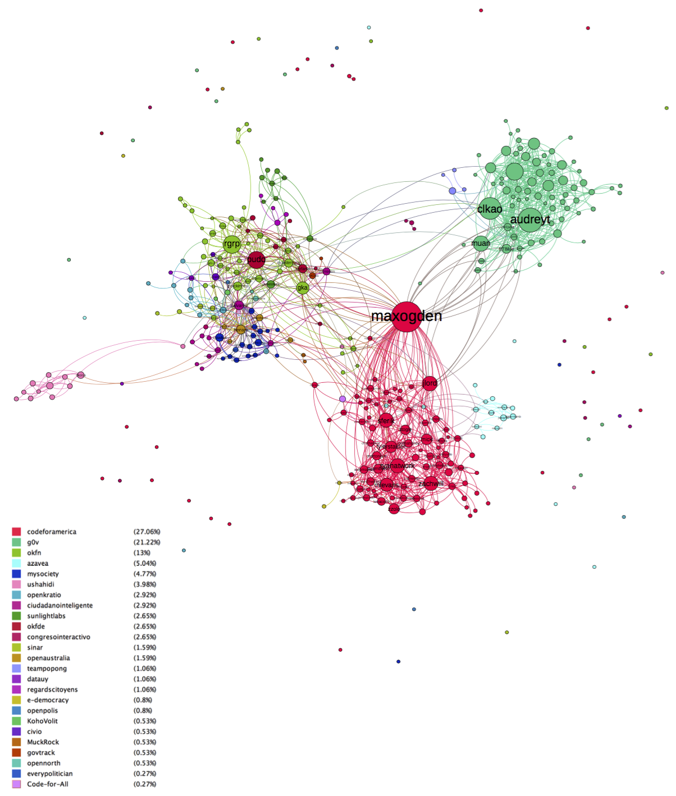
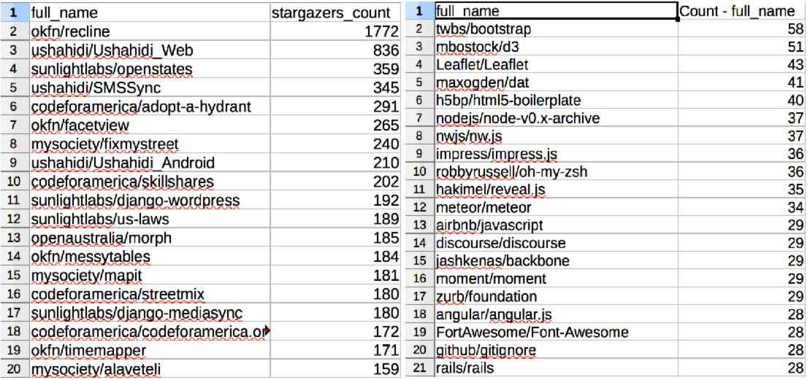
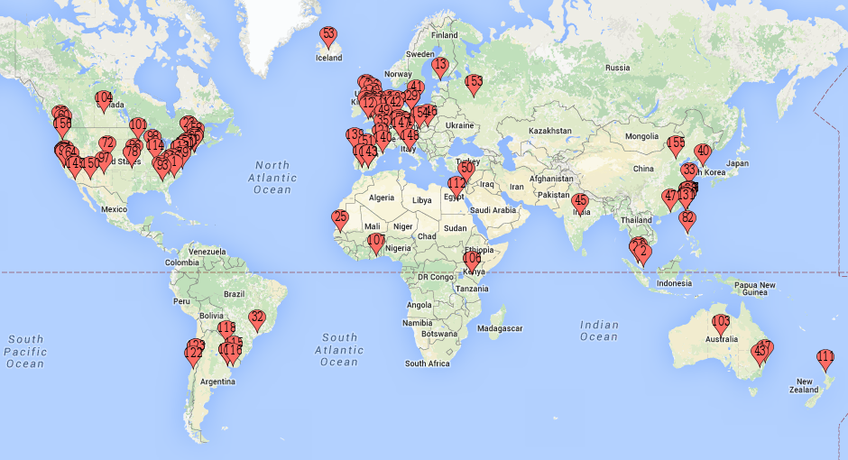


Check updated version [here]()


How can we describe the global civic tech community? To date, it's pretty hard to find answers to this question given that there is not even a consensus [on how to define civic tech](http://web.archive.org/web/20151009080407/https://www.mysociety.org/2014/09/08/civic-tech-has-won-the-name-game-but-what-does-it-mean/). However, there are some interesting proxies to explore this community. One of them is [GitHub](http://web.archive.org/web/20151117201802/https://github.com/) as most civic tech projects and developers are using it. Another one is the [Poplus community](http://web.archive.org/web/20151112053520/http://poplus.org:80/), which is a deliberate attempt to create a 'global federation for civic tech'.

I took [this list](https://www.google.com/maps/d/u/0/edit?mid=zIRpJTfhUk3U.kz3_0IC6HoQ4) of Poplus members and added a few organizations which were mentioned in the interviews I had with members of [mySociety](http://web.archive.org/web/20151108212610/https://www.mysociety.org/). Then I searched each organization on GitHub and ended up with this list of accounts:

    mysociety
    poplus
    everypolitician
    sinar
    opennorth
    okfn
    codeforamerica
    Code-for-All
    okfde
    openaustralia
    ushahidi
    sunlightlabs
    datauy
    congresointeractivo
    ciudadanointeligente
    govtrack
    MuckRock
    g0v
    civio
    openkratio
    KohoVolit
    regardscitoyens
    teampopong
    openpolis
    TEDICpy
    e-democracy
    azavea

I then wrote a [GitHub scraper](http://web.archive.org/web/20180612202138/https://github.com/sbaack/github-scraper) to gather some information about the activities of the members of these organizations. I should note directly that GitHub is just an *inaccurate proxy* to describe this community. To illustrate this with a very specific example, I talked with [Mark Longair](http://web.archive.org/web/20190423230933/https://github.com/mhl) who is a senior developer at mySociety. He has worked on many projects over the years and is an active member of the Poplus community -- but this is poorly reflected in my data because he is not making much use of GitHub’s social features such as following other users or starring repositories. Therefore, these findings should be met with skepticism. Nevertheless, I think a few interesting tendencies surfaced.

## The follower network

I generated a follower network to see how these organizations are connected with each other and which individuals are best connected within the larger civic tech community, i.e. who has the most connections across different organizations. This is the result (with the size of the nodes reflecting how many followers a user has):

[Download HiRes version](images/narrow_follower_network.png)

1. The most striking result is the key position of [maxogden](http://web.archive.org/web/20160111191819/https://github.com/maxogden). One reason: He develops some of the most popular tools among civic hackers, especially [dat](http://web.archive.org/web/20151028163917/https://github.com/maxogden/dat) (see below). Another, more simple explanation is that he makes extensive use of GitHub’s social features.
2. It's interesting to see how the different organizations group up by regions. In the upper right we have Asian groups, especially [g0v](http://web.archive.org/web/20150313164025/https://github.com/g0v) (green). At the bottom is the US with [Code for America](http://web.archive.org/web/20160119073845/https://github.com/codeforamerica) (red) being the dominant actor. Most interestingly, at the upper left we have a mix of mostly European and Latin American groups, but also some groups from Canada or Australia. This might be unsurprising considering that the Poplus federation was founded by mySociety from the UK and [Ciudadano Inteligente](http://web.archive.org/web/20150924165229/http://en.ciudadanointeligente.org/) from Chile. Still, it’s curious that European and Latin American groups seem so well connected, while North American and Asian groups are relatively separate (with the exception of maxogden, who is well connected to every continent).
3. At the far left is the African NGO [Ushahidi](http://web.archive.org/web/20160122090139/https://github.com/ushahidi), which only has a few connections to European groups. I would have expected them to be better connected. Maybe this is due to GitHub being an inaccurate proxy to illustrate these larger structures.

## The most popular repositories

To get a sense of which repositories are most popular among civic hackers, I looked at GitHub's 'starring' feature:

1. The left side lists the repositories owned by the civic tech organizations sorted by the number of stars. This means it shows which civic tech repositories are most starred among GitHub users in total, including those who are not part of any civic tech organization. Most popular by far is [Recline](http://web.archive.org/web/20160128144514/https://github.com/okfn/recline/), a library for 'building data applications in pure Javascript and HTML'. Ushahidi appears twice in the top 20, which indicates again that the follower network above is a bit off. In general, it’s interesting to see how the most popular civic tech repositories are a mix of data tools, tutorials, and ‘proof of concept’ exemplars of civic tech applications.
2. The right side shows the repositories which have been starred by the members of the civic tech organizations listed above, regardless of whether the starred repositories are own by civic tech organizations or not. A bit surprisingly, there are *no* civic tech repositories in the top 20. Beside that, the results are pretty much what one would expect: Tools to help developing websites and working with data. The popularity of [impress.js](http://web.archive.org/web/20151230131930/https://github.com/impress/impress.js) and [reveal.js](http://web.archive.org/web/20151106230937/https://github.com/hakimel/reveal.js) indicates that presenting at conferences or workshops about ideas and experiences is very common. I suggest that is also an expression of civic tech being a relatively new field with a lot of experimentation. What I could not figure out is the popularity of [Discourse](http://web.archive.org/web/20151104014721/https://github.com/discourse/discourse), an open source discussion platform.

## Locations and differences in civic tech around the world

GitHub allows users to specify their location. However, users are free to do that in whatever way they want, if they specify their location at all. Often, users just mention their home country or in some cases the continent they live on. It goes without saying that the [resulting map](http://web.archive.org/web/20200923052418/https://www.mapcustomizer.com/map/civic_tech_scrape) is inaccurate, but good enough to show the general direction:

Despite being increasingly global, this maps shows how much civic tech is a Western phenomenon. This is reflected in the interviews I had with members of mySociety, where it was pointed out the UK websites are a "magnitude busier and perhaps more successful" than in other places (especially in Africa) because they had ten years to grow.

Given that GitHub is platform for developers, this map also seems to underline some of the other comments from my interviews about the cultural differences in civic tech around the world. The dominance of developers in Europe and the US might be due to the fact that civic tech has stronger roots in the technology scene in these areas. By contrast, civic tech in Latin America is driven more strongly by activist groups who have discovered how useful civic tech applications can be to support their cause.