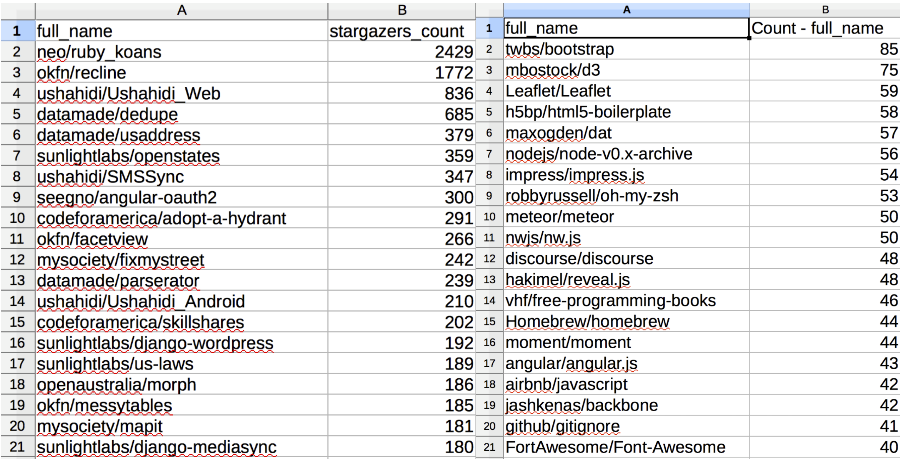
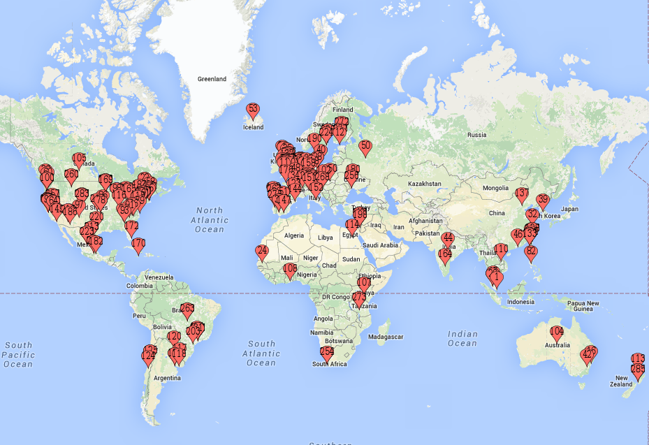

After I shared the post about my little [GitHub experiment]() in [mySociety's community mailing list](https://groups.google.com/a/mysociety.org/d/msg/mysociety-community/DyCFE7bk4_U/Diq9f9kqDwAJ), it became much more [popular than I anticipated](https://twitter.com/jwyg/status/667056707504316416). In the meantime, I got some help to compile [a more complete list of civic tech organizations on GitHub](data/organizations.txt) and spent all day scraping. Will the more complete list yield different results? Let's see!

I want to emphasize again that GitHub is an *inaccurate proxy* to describe the global civic tech community. Individuals or groups who are not using GitHub's social features (such as following or starring) are underrepresented in this data. Moreover, when we talk about civic tech on a global scale we are not only talking about developers. Naturally, activist groups are not using GitHub as much so they are underrepresented as well. Nevertheless, there are some interesting tendencies that this data reveals. If you're interested, you can find my scraper [here](https://github.com/sbaack/github-scraper/tree/v0.1) and the data used for this post [here](https://github.com/sbaack/sbaack.github.io/tree/main/content/posts/2015-11-19-scraping-the-global-civic-tech-community-on-github-part-2/data).

I also highly recommend to check [Liliana Bounegru's](http://web.archive.org/web/20160102081256/https://twitter.com/bb_liliana) work on using [GitHub to study data journalism and data activism with Digital Methods](http://web.archive.org/web/20151217230112/http://lilianabounegru.org/2015/07/08/github-as-transparency-device-in-data-journalism-open-data-and-data-activism/) -- this article heavily borrows from it!

## The follower network

First, let's recreate the follower network with the new dataset. Each node is a user; it's color indicates the organization he or she belongs to, while the size of the nodes reflects the number of followers (the more the bigger):

[Download HiRes version](images/follower-network_2015-11-19.png)

[maxogden](http://web.archive.org/web/20160111191819/https://github.com/maxogden) still has a very central position and is best connected across different continents. In my last post, I suggested that this is due to his extensive use of GitHub's social features and because he develops one of the most popular tools among civic hackers, [dat](http://web.archive.org/web/20151028163917/https://github.com/maxogden/dat). Meanwhile maxogden [commented](https://groups.google.com/a/mysociety.org/d/msg/mysociety-community/DyCFE7bk4_U/_rAKxaw7DwAJ) on it in mySociety's community mailing list:

> I'm guessing the reason I appear as a 'hub' is that I've had the privilege of being able to travel to the UK and Taiwan multiple times and meet the civic hacking communities there, as well as getting to contribute to open source civic hacking projects for the last 5 years more or less full time starting at Code for America in 2010. Hopefully over the next 5 years a lot more people will get the opportunity to get paid to work on civic software and travel to meet other communities!

I think his comment is very interesting because it points out how economic factors influence the structure of the network. It also underlines that the dominant European civic tech groups are stationed in the UK.

Similar to the previous version we can see how the community groups up by region:

- On the right side, we have civic tech groups from Asia: [g0v](http://web.archive.org/web/20150313164025/https://github.com/g0v) from Taiwan and [Team POPONG](http://web.archive.org/web/20141015060713/https://github.com/teampopong) from Korea.
- At the bottom we have the US cluster with [Code for America](http://web.archive.org/web/20160119073845/https://github.com/codeforamerica), [Sunlight Labs](http://web.archive.org/web/20151207140323/https://github.com/sunlightlabs), [Azavea](http://web.archive.org/web/20140619225306/https://github.com/azavea) and more.
- At the top left, we have the most diverse cluster, mainly with groups from Europe and Latin America ([OKFN](http://web.archive.org/web/20160105044447/https://github.com/okfn), [mySociety](http://web.archive.org/web/20160209041903/https://github.com/mysociety), and [Ciudadano Inteligente](http://web.archive.org/web/20160221095540/https://github.com/ciudadanointeligente) being the biggest groups), but also [Sinar](http://web.archive.org/web/20150322173522/https://github.com/Sinar) from Malaysia, several African groups (like [Ushahidi](http://web.archive.org/web/20160122090139/https://github.com/ushahidi) or [Code for Africa](http://web.archive.org/web/20170328171442/https://github.com/CodeForAfrica)), [Open North](http://web.archive.org/web/20150222234654/https://github.com/opennorth) from Canada, or [Open Australia](http://web.archive.org/web/20161228221425/https://github.com/openaustralia).

Why are US groups and g0v relatively separate from the rest? One possible reason is size: g0v and Code for America are probably the biggest civic tech organizations, at least when it comes down to the number of developers. This means they have more connections among each other and thus get clustered in the graph. Whether there is really something like a 'filter bubble' going on I cannot tell.

## The contributor network

As [Zarino rightfully pointed out](https://groups.google.com/a/mysociety.org/d/msg/mysociety-community/DyCFE7bk4_U/7Gu9SLo3DwAJ), we might get a more realistic picture of actual community ties when we look at who contributes to repos. I suggest that we can best understand the follower network above as a proxy for *exchange* (of ideas etc.), while the contributor network is more a proxy for *collaboration*. This time the color of the edges illustrates to which organization a repo belongs, while the size of the nodes reflects how many repositories a user has contributed to (the more the bigger):

[Download HiRes version](images/contributor-network_2015-11-19.png)

This network is a lot busier. I should point out that I had to filter out nodes with a low degree range to allow the remaining nodes to group up nicely. This means, to be precise, that every user who has contributed to less than five repos is filtered out.

1. First, there are some important similarities to the follower network: US groups are relatively close and separate from the rest, while groups from Europe, Latin America, Australia and elsewhere are close to each other at the bottom. However, we can see that Sunlight Labs has closer ties to Europe than Code for America.
2. When we look at collaboration, g0v seems to have much more ties to European groups than to the US.
3. It's interesting how the African groups split up here. In the follower network above they were close to each other and to the European groups. Here, Ushahidi is far outside on the right, while Code for Africa and Code for South Africa are much closer to the European and Latin American groups. It seems there is a lot of exchange, but not much collaboration between Ushahidi and groups from Europe or elsewhere.
4. An Asian group which was almost invisible in the follower network is much more prominent here: [Neo](http://web.archive.org/web/20190406004918/https://github.com/neo) from Singapore. Despite being geographically close to g0v (relatively speaking) they do not seem to collaborate very much. Moreover, Neo seems to be closer to US groups, while g0v is closer to Europe.
5. maxogden lost his central position. When we look at where he works or where he contributes to, he is much closer to the US groups than to other groups around the world (you can find his node above the 'Sunlight Labs' label).
6. In case anybody wonders: Rufus Pollock aka [rgrp](http://web.archive.org/web/20131126155954/https://github.com/rgrp) from Open Knowledge contributed to the most repos.
7. In the middle, the different clusters seem to be connected by a relatively thin web of tools which are popular among civic hackers but do not necessarily belong to any civic tech organization (like Discourse).

## The most popular repositories

Let's check GitHub's starring feature again:

1. As before, the left side lists the repositories owned by the civic tech organizations sorted by the number of stars. This means it shows which civic tech repositories are most starred among GitHub users in total, including those who are not part of any civic tech organization. Surprisingly, we have a new winner: [Neo's Ruby Koans](http://web.archive.org/web/20160125162830/https://github.com/neo/ruby_koans) tops [Recline](http://web.archive.org/web/20160128144514/https://github.com/okfn/recline/). Beside that, not much has changed: the most popular civic tech repositories are a mix of data tools, tutorials, and ‘proof of concept’ exemplars of civic tech applications.
2. The right side again shows the repositories which have been starred by the members of the civic tech organizations in our dataset, regardless of whether the starred repositories are own by civic tech organizations or not. No big changes here either: The most popular repos among civic hackers are tools to help developing websites and working with data. As mentioned before, the popularity of [impress.js](http://web.archive.org/web/20151230131930/https://github.com/impress/impress.js) and [reveal.js](http://web.archive.org/web/20151106230937/https://github.com/hakimel/reveal.js) indicates that presenting at conferences or workshops about ideas and experiences is very common, which suggests that civic tech is still a relatively new field with a lot of experimentation. Still wondering about the popularity of [Discourse](http://web.archive.org/web/20151104014721/https://github.com/discourse/discourse).

## Locations and differences in civic tech around the world

Last but not least, I recreated the map showing the location of different civic hackers around the world. Again, GitHub allows users to specify their location in whatever way they want, if they specify their location at all. Often, only the home country or the continent is mentioned, which means that [this map](http://www.mapcustomizer.com/map/civic_tech_scrape2) is inaccurate but shows some general tendencies:

Again, not much changed. We have a few more civic hackers in Mexico, the Middle East and Asia, but my previous analysis still holds, so I just repeat it here: Despite being increasingly global, this maps shows how much civic tech is a Western phenomenon. This is reflected in the interviews I had with members of mySociety, where it was pointed out the UK websites are a "magnitude busier and perhaps more successful" than in other places (especially in Africa) because they had ten years to grow.

Given that GitHub is platform for developers, this map also seems to underline some of the other comments from my interviews about the cultural differences in civic tech around the world. The dominance of developers in Europe and the US might be due to the fact that civic tech has stronger roots in the technology scene in these areas. By contrast, civic tech in Latin America is driven more strongly by activist groups who have discovered how useful civic tech applications can be to support their cause.

## Feedback welcome!

As mentioned above, this was a little experiment to get a grasp about the civic tech community on a global scale. I would love to hear from people involved in this community how they read these information and whether my interpretations somewhat match reality.