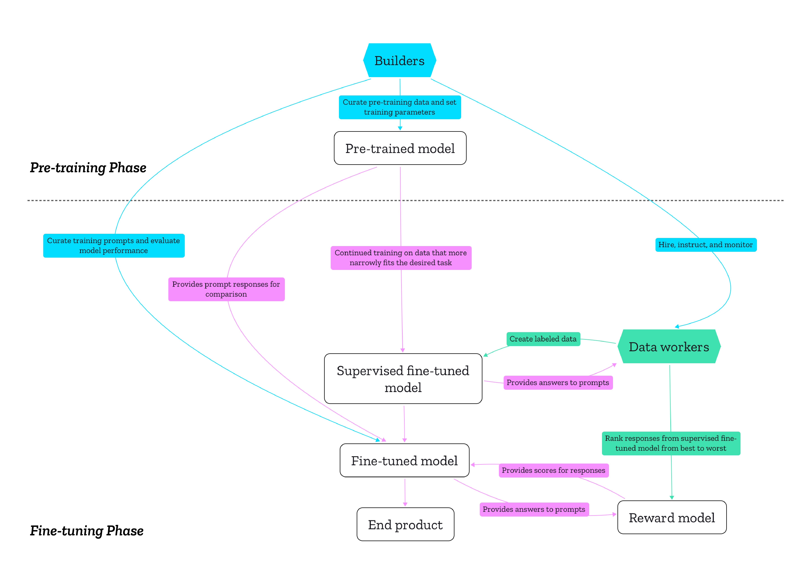

+++ 
draft = true
date = 2023-08-02
title = "The human decisions that shape generative AI: Who is accountable for what?"
description = ""
slug = ""
authors = []
tags = ["generative AI"]
categories = []
externalLink = ""
series = []
+++

_This article was first [published](https://foundation.mozilla.org/en/blog/the-human-decisions-that-shape-generative-ai-who-is-accountable-for-what/) on the [Mozilla Foundation Blog](https://foundation.mozilla.org/en/blog/)._

The people who build generative AI have a huge influence on what it is good at, [and who does and doesn’t benefit from it](https://stoplapdspying.medium.com/the-algorithmic-ecology-an-abolitionist-tool-for-organizing-against-algorithms-14fcbd0e64d0). Understanding how generative AI is shaped by the objectives, intentions, and values of its creators demystifies the technology, and helps us to focus on questions of accountability and regulation. In this explainer, we tackle one of the most basic questions: What are some of the key moments of human decision-making in the development of generative AI products? This question forms the basis of our current research investigation at Mozilla to better understand the motivations and values that guide this development process. For simplicity, let’s focus on text-generators like ChatGPT.

We can roughly distinguish between two phases in the production process of generative AI. In the _pre-training phase_, the goal is usually to create a Large Language Model (LLM) that is [good at predicting the next word in a sequence](https://huggingface.co/learn/nlp-course/chapter1/4) (which can be words in a sentence, whole sentences, or paragraphs) by training it on large amounts of data. The resulting pre-trained model “learns” how to imitate the patterns found in the language(s) it was trained on.

This capability is then utilized by adapting the model to perform different tasks in the _fine-tuning phase_. This adjusting of pre-trained models for specific tasks is how new products are created. For example, OpenAI’s [ChatGPT](https://chat.openai.com/) was created by “teaching” a pre-trained model — called GPT-3 — how to respond to user prompts and instructions. [GitHub Copilot](https://github.com/features/copilot), a service for software developers that uses generative AI to make code suggestions, also builds on a [version of GPT-3](https://openai.com/blog/openai-codex) that was fine-tuned on “billions of lines of code.”

To help illustrate this, Figure 1 below provides a high-level overview of how builders (blue) work in concert with data workers (green), who label, write, and evaluate data that is then fed to generative models. Builders are the decision-makers: the managers, coders, designers, and others who develop the AI model. They determine what the AI is optimized for, what trade-offs are being made in terms of performance and safety, and who is hired to do the manual data labor under what conditions. This manual labor is conducted by the second main group: the data workers. They are hired by the builders either directly or through agencies like Amazon Mechanical Turk that relay [detailed instructions](https://www.theverge.com/features/23764584/ai-artificial-intelligence-data-notation-labor-scale-surge-remotasks-openai-chatbots) to sometimes hundreds or even thousands of workers doing remote task work. Often, this is [precarious labor](https://time.com/6247678/openai-chatgpt-kenya-workers/).

Note that Figure 1 is a simplification that a) doesn’t take into account every intervention in the production process, and b) assumes it’s the same group of builders doing the pre-training and the fine-tuning, as in the ChatGPT example. In practice, they can be different groups.

|                                         |
| :------------------------------------------------------------------: |
| _Figure 1: A high-level overview of creating generative AI products_ |

Let’s take a closer look at the instances of human decision-making in this production process.

# Pre-training phase: Gathering and filtering the data

Decision-making in the pre-training phase is often shaped by a mindset of “the bigger, the better.” A common rationale is that the more data an LLM is trained on, the more capable it will be. While there are discussions and research that [question](https://arxiv.org/abs/2305.13048) and [challenge](https://arxiv.org/abs/2306.13141) this notion, it remains a dominant paradigm in AI research and development. In practice, this means that pre-training is about creating large datasets consisting of text, images, audio, and other forms of data, using automated techniques. Techniques that require human labor (like labeling data) are increasingly dismissed as too expensive and slow. (That kind of labor will usually only happen in the fine-tuning phase.)

To make this possible, pre-training relies on “[unsupervised learning](https://huggingface.co/docs/transformers/main/en/glossary#unsupervised-learning),” a technique where builders don’t provide the model with labels to categorize information, but instead, instruct the model to find patterns in the data itself. This enables builders to train models on large amounts of unstructured data.

So what data is typically used? In many generative AI projects, at least those transparent enough to share information about their training data, builders combine a free dataset called [Common Crawl](https://commoncrawl.org/) with various other, smaller datasets (note that small in comparison to Common Crawl’s [hundreds of terabytes of data](https://commoncrawl.org/2023/04/mar-apr-2023-crawl-archive-now-available/) might still be several hundred gigabytes large). Common Crawl is maintained by a nonprofit organization of the same name that has scraped — and continues to scrape — billions of web pages [since 2008](https://commoncrawl.org/the-data/get-started/), in what it describes as a [large sample of the open web](https://www.forbes.com/sites/kalevleetaru/2017/09/28/common-crawl-and-unlocking-web-archives-for-research/), [mostly](https://commoncrawl.github.io/cc-crawl-statistics/plots/mimetypes) in the form of HTML text files. It’s an incredible resource, but it also contains [a lot of pornographic, toxic, and biased content](https://arxiv.org/abs/2105.02732) and “noise” (like the names of menu items and duplicates). This is by design: Common Crawl is not specifically about helping AI developers to train models, but to more generally enable research and business models with its data. Hate speech is not removed from Common Crawl because it wants the data to be potentially useful for researchers studying hate speech, for example. This has two important implications for LLMs. Common Crawl’s “noise” negatively impacts the technical performance, while the problematic content leads to LLMs (re)producing bias and toxicity. Therefore, undesirable content has to be filtered out of Common Crawl before the pre-training without actually looking at its contents (because it’s too large). But how? Sometimes builders filter the data themselves, but often they prefer to use versions filtered by others.

Let’s look at a concrete example: Google’s [Colossal Clean Crawled Corpus](https://arxiv.org/abs/1910.10683) (C4), which is one of the most popular filtered versions of Common Crawl used to train generative AI. Some of the filtering steps the authors took include: only keep English pages, only retain lines that end in a terminal punctuation mark, discard any page with fewer than five sentences, remove pages that contain a curly bracket (because it’s considered programming code), delete redundant data, and remove any page that contains any of a few hundred words in the “[List of Dirty, Naughty, Obscene, and Otherwise Bad Words](https://github.com/LDNOOBW/List-of-Dirty-Naughty-Obscene-and-Otherwise-Bad-Words).” Most of these steps are about ensuring that only pages with “proper” full text are kept, while the last one is mostly about filtering out pornographic content, as most of the keywords relate to that. Another approach to filtering Common Crawl not used in C4 is taking a dataset that is considered “high quality” — e.g. URLs shared and upvoted on Reddit or Wikipedia articles — and then using an AI classifier to only extract pages from Common Crawl that are statistically similar to this reference.

Even if they are not used for filtering, builders often combine smaller datasets with Common Crawl to improve LLM performance because of their perceived quality or because they are more focused and teach the model particular ways of using language (for example legal jargon or dialog). Popular examples beside Wikipedia and Reddit are [ArXiv](https://arxiv.org/) for scientific writing, [Github](https://github.com/) for code, and [Project Gutenberg](https://www.gutenberg.org/) for books. It’s worth noting that these training datasets are not necessarily created by builders.

If we set aside questions about the premise that more data results in better performance, builders have a lot of important decisions to make that will ultimately shape their LLM:

- Size | How much data is good enough? Would a smaller model trained on less data be sufficient, or is the goal to maximize performance on more general performance tests, like those used in [leaderboards](https://huggingface.co/spaces/HuggingFaceH4/open_llm_leaderboard)?
- Purpose | While pre-trained models are purportedly designed to be fine-tuned for multiple downstream tasks, that doesn’t mean they’re fit for all tasks ([even though LLM maximalists would disagree](https://explosion.ai/blog/against-llm-maximalism)). Depending on their pre-training, some models are better suited for particular types of tasks than others.
    - What should the products built on top be capable of, and what datasets will support those tasks?
- Values | If the decision is made to use Common Crawl or similar sources scraped off the web, what kind of filtering should be used, and what should be filtered out? Especially when it comes to toxic and pornographic content, perfect automated detection and filtering does not exist. To [quote](https://arxiv.org/abs/2006.16923) the AI researchers Vinay Uday Prabhu and Abeba Birhane, “Feeding AI systems on the world’s beauty, ugliness, and cruelty, but expecting it to reflect only the beauty is a fantasy.” In fact, [evidence suggests](https://arxiv.org/abs/2306.13141) that scaling up the pre-training data using sources like Common Crawl with light automated filtering also scales up the toxic behavior of the resulting model. Simple solutions like the keyword list used in C4 are proven [to be insufficient](https://www.washingtonpost.com/technology/interactive/2023/ai-chatbot-learning/) to remove toxic and biased content, and they risk [making the data less representative](https://arxiv.org/abs/2104.08758) by [excluding LGBTQIA+ content for example](https://www.wired.com/story/ai-list-dirty-naughty-obscene-bad-words/). This begs the questions:
    - What is “clean” data, and can you ever achieve such a state?
    - How much toxicity do builders find acceptable from a risk and safety perspective?
    - Whose perspectives do they ensure are represented — and whose are left out?

# Fine-tuning phase: Writing, labeling, and evaluating data

For most people, a pre-trained model for text generation is not very useful on its own. It basically can only continue a given sequence of words based on its prediction of what next word is likely to follow from the previous text. If you were to prompt a pre-trained model with a question like “What is Mozilla?” it might not respond to your question, but instead generate similar or related questions like “What is Firefox?” or “What is open source?” A pre-trained model alone doesn’t follow instructions or make coding suggestions in ways that are intuitive to most people. Therefore, there needs to be more training to develop useful applications. This process is referred to as “fine-tuning.”

There are various techniques to fine-tune a language model, but the technique most common for generative AI products to date is called “[reinforcement learning from human feedback](https://huggingface.co/blog/rlhf)” (RLHF). As the name suggests, the key difference to the pre-training phase is that hands-on, i.e. manual, creation and evaluation of data by people is essential. It’s a complex process that involves multiple steps that allow for a lot of variation, though many builders roughly follow the steps [outlined by OpenAI](https://arxiv.org/abs/2203.02155) in the case of text generators. Here is a high-level overview of these steps:

1. Supervised fine-tuning (SFT): Builders continue to train the pre-trained model for a specific task using [supervised learning](https://huggingface.co/docs/transformers/main/en/glossary#supervised-learning), meaning that they provide the model with data labeled by people, i.e. by data workers. In the case of chat applications like ChatGPT, they might be tasked to write hundreds or thousands of examples of prompts and answers to them. This is a first step toward teaching the chatbot to respond to different types of prompts correctly, so instead of responding to a question with more questions, it will provide an answer. This turns the pre-trained model into an “SFT model.”
2. Reward modeling (RM): To further adjust the SFT model on a larger scale, builders create yet another AI model: the reward model. To train it, they create a new dataset consisting of prompts and answers to each prompt generated by the SFT model. Data workers rate those responses from best to worst following instructions from builders. Typically, these instructions not only take performance into account, but also toxicity and bias. The reward model is trained on this data to predict which responses to a given prompt would be preferred by the human annotators that provided the training data.
3. Reinforcement learning (RL): Again, the builders curate a list of prompts and let the SFT model generate one or more answer(s) for each. The reward model scores each answer, and the SFT model becomes a fine-tuned model by optimizing it to score as high as possible. However, there is a problem: if left unchecked, the fine-tuned model might eventually generate text that is just gibberish but scores highly. Therefore, builders take another step: They let the pre-trained model generate answers to the same prompts, and add a score penalty depending on how much the fine-tuned model deviates from the pre-trained model. As a result, the fine-tuned model generates answers that score high while still being “close enough” (however defined) to the pre-trained model. Builders then test the resulting fine-tuned model and decide whether it’s good enough or requires more training.

In sum, the fine-tuning process relies on lots of human labor to create the data needed for supervised learning and the training of the reward model, which ultimately strives to abstract this human labor away by imitating it. There are a number of inflection points in the development process where builders should ask critical questions. To name just a few among them:

- Values | As OpenAI [points out](https://arxiv.org/pdf/2203.02155.pdf), fine-tuning “aligns the behavior of GPT-3 [or any other pre-trained model] to the stated preferences of a specific group of people… rather than any broader notion of ‘human values.’” So with whose values do builders want their models to “align”? The privileged few that build and deploy models, or those who are most negatively impacted by the tech? Who should be allowed to create labeled data and to pick preferences? What instructions should they follow? Relatedly, who is the product built for? Is noting “best” and “worst” responses the best way to train it when it comes to normative judgment? Is it better to select for accuracy? How should they deal with disagreements and cultural differences among builders and the people hired to create and evaluate training data?
- Influence of working conditions | How are data workers paid and acknowledged, and what are their working conditions? These factors are obviously important from a human rights perspective, but builders should also reflect on how this might influence how data workers interpret instructions and, subsequently, what data they produce.
- Qualifications | Who among the builders is qualified to make decisions about the questions raised here? Is there a person who [specializes in methodologies for data collection and annotation](https://dl.acm.org/doi/10.1145/3351095.3372829) with an eye for fairness, accountability, transparency, and ethics? Likewise, what qualifications should data workers have?

# The bigger picture: The limits of fine-tuning

Current discussions around generative AI often rely on two assumptions:

1. If large enough, pre-trained models are “general purpose” in the sense that they can be adjusted for any language-related task via fine-tuning.
2. Toxicity and bias contained in the pre-training data can be sufficiently contained via fine-tuning, [turning LLMs from unsupervised monsters into helpful assistants](https://www.nytimes.com/2023/05/30/technology/shoggoth-meme-ai.html).

These assumptions justify taking huge amounts of data scraped off the internet with little filtering for toxicity in the pre-training. However, there is no neat separation between toxicity in the pre-training data and the behavior of the fine-tuned end product. Fine-tuning can suppress toxicity contained in the pre-trained model to an extent, but it doesn’t completely remove it — not least because the fine-tuning process includes a penalty for deviating too much from the pre-trained model. Exactly where the dividing line between pre-training and fine-tuning is located is unclear, which raises difficult questions for accountability and regulation, especially in cases where the providers of the pre-trained model and the people conducting fine-tuning are not the same. If an AI chatbot makes racist remarks, is the provider of the pre-trained model to be blamed, or the chatbot provider that fine-tuned it? These problems are exacerbated by the fact that many aspects in the development of generative AI often remain opaque. This is especially true for commercial generative AI products [like GPT-4](https://www.theverge.com/2023/3/15/23640180/openai-gpt-4-launch-closed-research-ilya-sutskever-interview), but even open source models [vary greatly in their degree of openness](https://opening-up-chatgpt.github.io/) regarding development and documentation. Better transparency and interpretability of generative AI models is needed to address questions like this.

Generative AI products can only be trustworthy if their _entire_ production process is conducted in a trustworthy manner. Considering how pre-trained models are meant to be fine-tuned for various end products, and how many pre-trained models rely on the same data sources, it’s helpful to understand the production of generative AI products in terms of infrastructure. As media studies scholar Luke Munn [put it](https://doi.org/10.4324/9781003341185), infrastructures “privilege certain logics and then operationalize them”. They make certain actions and modes of thinking possible ahead of others. The decisions of the creators of pre-training datasets have downstream effects on what LLMs are good or bad at, just as the training of the reward model directly affects the fine-tuned end product.

Therefore, questions of accountability and regulation need to take both phases seriously and employ different approaches for each phase. To further engage in discussion about these questions, we are conducting a _study about the decisions and values that shape the data used for pre-training_: Who are the creators of popular pre-training datasets, and what values guide their work? Why and how did they create these datasets? What decisions guided the filtering of that data? We will focus on the experiences and objectives of builders of the technology rather than the technology itself with interviews and an analysis of public statements. Stay tuned!

_Thank you to the reviewers of this article (in alphabetical order): J. Bob Alotta, Abeba Birhane, Maximilian Gahntz, Solana Larsen, Jesse McCrosky, Eeva Moore, Kasia Odrozek, Bogdana Rakova, Kenrya Rankin, Becca Ricks._